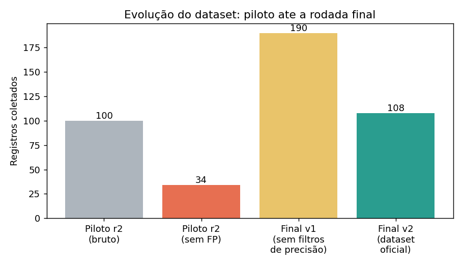
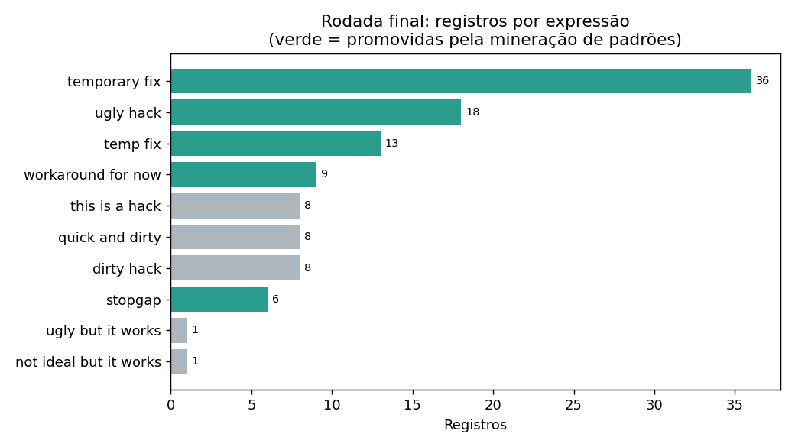
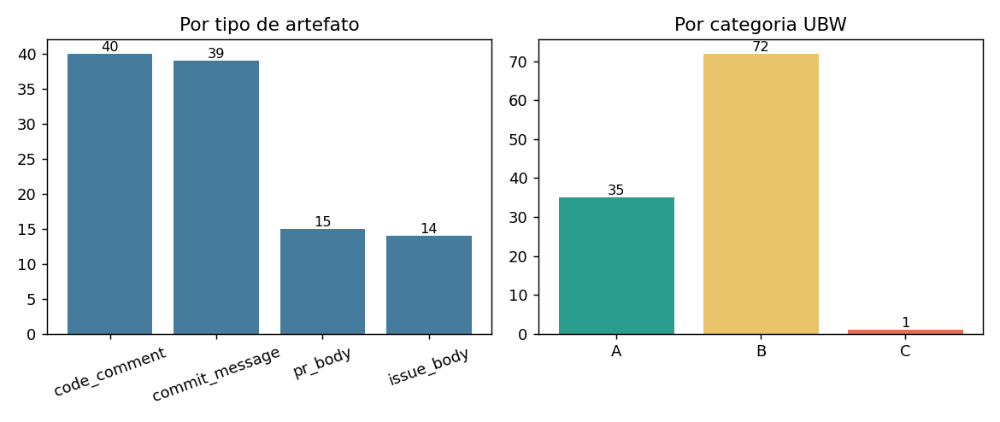

# UBW: Resultados da Rodada Final de Coleta

**Data de corte:** 2026-07-03 | **Corpus:** 134 repositórios canônicos | **Dataset:** `data/final/ubw_collected_full.csv`

Este documento consolida a implementação final e otimizada do pipeline de coleta, executada em 2026-07-03, incorporando todos os achados do piloto (RESULTADOS_PILOTO.md) e da mineração de padrões estruturais. O piloto permanece intacto em `data/` para comparação.

## 1. Resumo executivo

A rodada final produziu **108 registros de alta precisão em 37 repositórios** (28% do corpus com pelo menos uma ocorrência). Para comparação, o piloto produziu 100 registros, dos quais 66 eram falsos positivos das expressões removidas ("magic number", "don't touch"), sobrando ~34 registros limpos. Ou seja, a rodada final triplicou o volume de dados utilizáveis, com precisão amostral muito superior, sobre um corpus mais limpo.



As cinco expressões promovidas pela mineração de padrões respondem por **82 dos 108 registros (76%)**: "temporary fix" (36), "ugly hack" (18), "temp fix" (13), "workaround for now" (9) e "stopgap" (6). Sem a etapa de mineração, o dataset final teria cerca de um quarto do tamanho.

## 2. O que mudou em relação ao piloto

### 2.1 Léxico v3 (25 expressões ativas)

- Removidas em 2026-07-01: "magic number" (0/10 verdadeiro positivo) e "don't touch" (0/12), decisão do orientador.
- Promovidas em 2026-07-03, com base na mineração de padrões (50 repositórios, checagem manual de todos os candidatos): "ugly hack" (Categoria A), "temporary fix", "temp fix", "stopgap" e "workaround for now" (Categoria B).
- Registro completo em `ubw/lexicon.py` (CHANGELOG, `PROMOTED_EXPRESSIONS`, `REMOVED_EXPRESSIONS`). A promoção segue pendente de validação formal com o orientador.

### 2.2 Corpus canonicalizado (140 para 134 repositórios)

O snapshot do SEART-GHS guardava nomes desatualizados de repositórios renomeados. O novo `scripts/05_canonicalize_repos.py` resolve o nome atual via REST API (que segue redirect, ao contrário do qualificador `repo:` da Search API) e deduplica:

- 33 nomes desatualizados corrigidos;
- 6 pares duplicados fundidos (o mesmo repositório aparecia com nome antigo e novo);
- 0 repositórios inacessíveis;
- os 13 bloqueios HTTP 422 do piloto desapareceram por completo.

Relatório detalhado em `data/canonicalization_report.json`.

### 2.3 Otimização de tempo: busca em lotes

A Search API aceita múltiplos qualificadores `repo:` na mesma query, com semântica de OR (verificado ao vivo em `/search/issues` e `/search/commits`). A coleta passou de 1 query por (expressão, repositório) para 1 query por (expressão, lote de ~7 repositórios), respeitando o teto de 256 caracteres do parâmetro `q`:

| | Queries | Tempo estimado da fase de API |
|---|---|---|
| Desenho anterior | 10.500 | ~5,8 h |
| Desenho final | 1.425 | ~48 min |

Somada à paralelização de `code_comment` (pool de 6 workers, já existente), a rodada completa dos 134 repositórios levou **57 minutos**.

### 2.4 Filtros de precisão novos (achados desta rodada)

A primeira execução da rodada final coletou 190 registros. A inspeção revelou duas classes de contaminação no canal da Search API, que motivaram dois filtros novos no coletor:

1. **Artefatos de bots (51 descartes).** PRs de dependabot/renovate citam o CHANGELOG da dependência atualizada; quando o changelog de terceiro contém "temporary fix", o PR aparece na busca. A admissão é do autor da dependência, não do time do repositório. Mesma classe de contaminação do vendoring em `code_comment`, agora no canal de issues/PRs. Filtro: descarte por login do autor (`dependabot[bot]`, `renovate[bot]` etc.).

2. **Matches não literais da API.** A busca por frase entre aspas do GitHub aplica stemming: "temporary fix" casou com "temporarily fix", "quick and dirty" com "quick/dirty". Em PRs de dependabot com changelog truncado, a frase indexada nem sequer está no body retornado. Como o léxico é fechado e literal (Seção 3.2 do plano), o coletor agora exige a frase literalmente presente no corpo do artefato (tolerando pontuação e quebra de linha, não stemming). Esse filtro também eliminou duplas contagens (ex: "ugly but works" casando por stemming num body que já gerava o registro de "ugly but it works").

3. **Contexto de path (1 descarte).** "stopgap" é palavra única e casava em nomes de arquivo ("/Tools/stopGap/gClient.py"). O filtro `match_is_path_only` julga cada ocorrência pelo token que a contém e descarta apenas quando todas as ocorrências estão em contexto de path. Aplicado nos 4 tipos de artefato.

Os matches com stemming descartados ("temporarily fix", "quick/dirty", "hack/workaround") ficam no log da coleta e são candidatos naturais para uma futura rodada de mineração.

## 3. O dataset final





**Por artefato:** code_comment 40, commit_message 39, pr_body 15, issue_body 14.

**Por categoria:** B (workaround/urgência) 72, A (estética/hack explícito) 35, C (resignação/incerteza) 1. A escassez de Categoria C é esperada: era a categoria com maior risco de falso positivo e foi a mais enxugada; as candidatas novas de C testadas na mineração ("not the best solution but" etc.) tiveram zero hits.

**Censura e eventos (insumo de RQ2):** code_comment tem 28 remoções observadas e 12 censuras, a melhor razão evento/censura entre os artefatos. issue_body tem 12 fechamentos observados. commit_message é sempre censurado por construção (imutável). pr_body tem os 15 registros com evento observado (merge/fechamento).

**Subconjunto RQ2 (threshold >= 3 em um artefato):** 7 repositórios: 0xPolygon/bor (18), 0xPolygonHermez/zisk (8), 10up/ElasticPress (6), 1024pix/pix (5), 0xchocolate/flipperzero-wifi-marauder (4), 0xsequence/sequence.js (3), 10up/10up-toolkit (3).

## 4. Exemplos de registros das expressões promovidas

- **ugly hack / code_comment (0chain/0chain):** `mc.AddBlock(lfb) //ugly hack: for error "node not found"`
- **ugly hack / code_comment (0xPolygon/bor):** `Use an ugly hack to construct a large key to represent it`
- **temp fix / commit_message (0chain/0chain):** `A temp fix for txn leak`
- **workaround for now / code_comment (10up/ElasticPress):** `Shallow cloning props works as a workaround for now to bypass the bailout check`
- **stopgap / pr_body (0xMiden/miden-vm):** `This is a stopgap to CI failing post nightly update. The long-term fixes would be to fix this in...`

## 5. Alertas metodológicos em aberto (decisão do orientador)

1. **Threshold RQ2 continua excludente.** Mesmo com o threshold reduzido para 3 (Seção 2.4), 30 dos 37 repositórios com ocorrência (81%) ficam fora do subconjunto de sobrevivência, acima do gatilho de 40% do plano. O threshold 3 já é o mínimo previsto; as opções são expandir o corpus, aceitar a exclusão como característica do fenômeno (ocorrências UBW são raras e dispersas), ou revisitar o desenho de RQ2.

2. **Promoção do léxico a validar.** As 5 expressões promovidas têm evidência empírica documentada, mas o plano exige aval do orientador para mudanças no léxico fechado.

3. **Categoria C quase vazia.** Com 1 registro, qualquer análise por categoria ficará desbalanceada. Pode ser característica real do fenômeno (resignação explícita é rara) ou limitação do léxico atual de C.

## 6. Reprodutibilidade

```
# 1. Canonicalizar o corpus (SEART snapshot -> nomes atuais, sem duplicatas)
python scripts/05_canonicalize_repos.py

# 2. Coleta completa (batched + paralela + filtros de precisão)
python scripts/02_collect_multiartifact.py \
    --repos-csv ../data/repos_to_mine_canonical.csv \
    --out-dir ../data/final \
    --state-file ../data/final/collection_state.json \
    --clone-dir ../data/final/clones \
    --parallel-workers 6
```

Logs completos das duas execuções em `data/final/collect_run.log` (v1, sem filtros de precisão, 190 registros) e `data/final/collect_run_v2.log` (v2, dataset oficial, 108 registros). Data de corte gravada no log: 2026-07-03T18:02:00Z.
