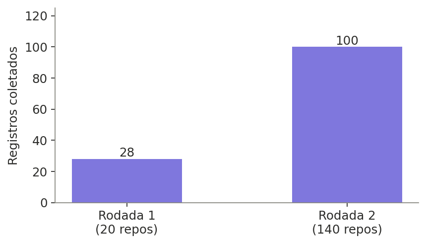
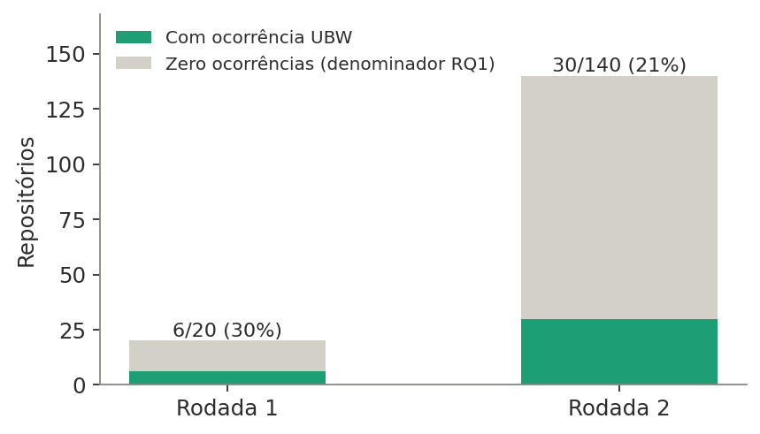
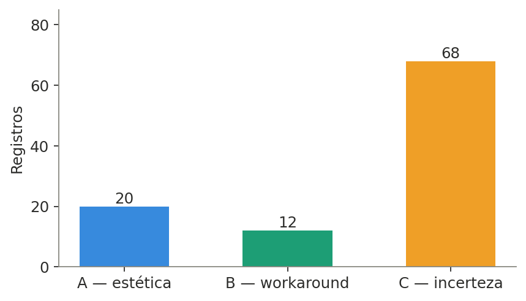
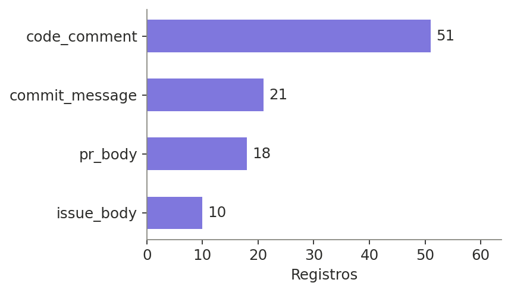
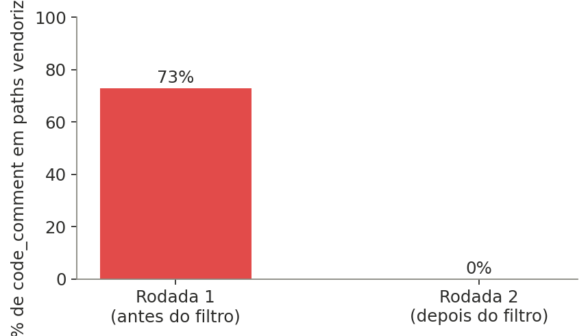
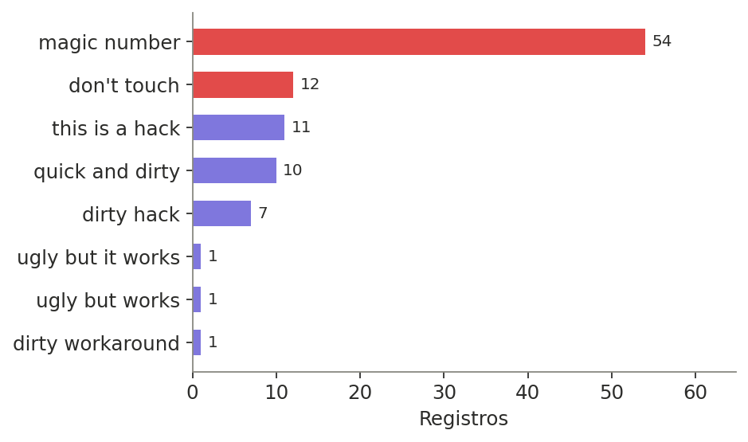
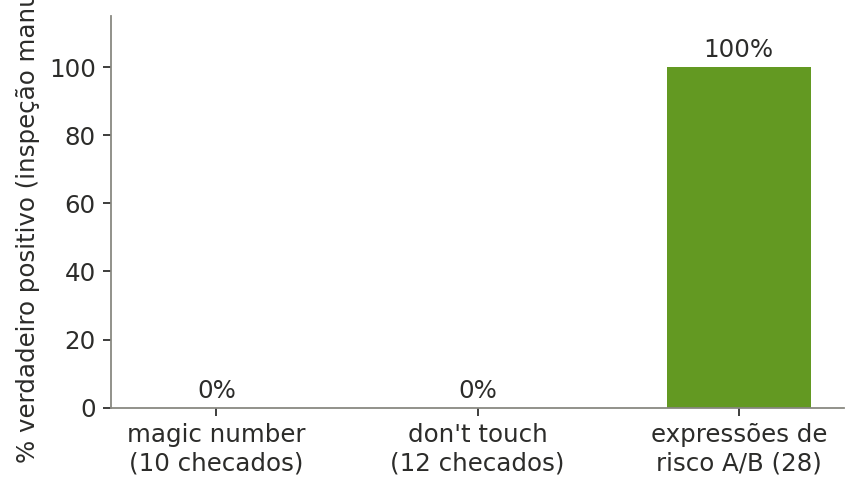

# Resultados do piloto exploratório: dataset UBW

**Corpus:** 140 repositórios (SEART-GHS, critérios da Seção 2.2) · **Escopo:** piloto exploratório (Seção 3.1 do plano), não o corpus final

---

## 1. Resumo executivo

- **100 registros** UBW coletados em **30 dos 140 repositórios** (21%) do corpus.
- **5 repositórios** atingem o threshold de inclusão para análise de sobrevivência (≥5 ocorrências, Seção 2.4).
- Duas expressões de alto risco (⚠ na Seção 3.2 do plano), **"magic number"** e **"don't touch"**, concentram **66% de todos os registros** e, numa amostra manual de 22 casos, **nenhum foi confirmado como verdadeiro positivo**.
- Um problema de contaminação por código vendorizado (73% dos `code_comment` da rodada 1) foi identificado e corrigido antes da rodada 2 (caiu para 0%).

---

## 2. Linha do tempo do piloto

| Etapa | O quê | Resultado |
|---|---|---|
| Rodada 1 | 20 repositórios, léxico completo, 4 tipos de artefato | 28 registros; achados de qualidade (ver Seção 4) |
| Correção | Filtro de vendoring + 3 correções de schema (Tabela 3.5) | Ver Seção 6 |
| Rodada 2 | 140 repositórios (20 da rodada 1 + 120 novos) | 100 registros; achados confirmados em escala maior |

---
** but works colocar apenas está expressão **

## 3. Volume coletado





A maioria dos repositórios do corpus **não** contém nenhuma expressão do léxico, e isso é esperado, não um problema. A Seção 2.4 do plano é explícita: *"RQ1 é calculada sobre todos os repositórios do corpus, inclusive os com zero ocorrências, que entram como denominador."* A triagem (SEART-GHS) seleciona por critérios de maturidade/qualidade de projeto (Munaiah et al., 2017), não por conter ou não o léxico. Isso preserva a validade da pergunta "com que frequência UBW ocorre?" (RQ1): se só entrassem no corpus repositórios que já sabíamos conter a expressão, a resposta seria 100% por construção.

---

## 4. Distribuição dos dados (rodada 2, dados atuais)





`code_comment` domina (51/100), seguido por `commit_message` (21, sendo que na rodada 1 esse número era zero; a rodada maior confirma que não era bug, só amostra pequena). A Categoria C concentra 68% dos registros, mas isso é enganoso, ver Seção 7.

---

## 5. Exemplos reais coletados (Categorias A e B)

Trechos abaixo vieram diretamente do dataset coletado (não são ilustrativos) e passaram por checagem manual de contexto. Os critérios operacionais estão no [guideline de anotação](ANNOTATION_GUIDELINE.md).

### Categoria A: julgamento estético e hacks explícitos

**`0xchocolate/flipperzero-wifi-marauder`** (`code_comment`, expressão `dirty hack`)
```c
// dirty hack, f3 has no CHARGING pin
// TODO rewrite this
if(i < GPIO_INPUT_PINS_COUNT) {
```
[applications/input/input.c#L58](https://github.com/0xchocolate/flipperzero-wifi-marauder/blob/eb2679b982b69b10b783cb9fd21ad6eb23a1aa6a/applications/input/input.c#L58)

**`0rpc/zerorpc-python`** (`pr_body`, expressão `ugly but it works`)
> fix issue #142
> Little bit ugly but it works.

[PR #143](https://github.com/0rpc/zerorpc-python/pull/143)

**`0xPolygon/bor`** (`code_comment`, expressão `dirty hack`)
```go
// The original client side code has a dirty hack to retrieve
// the headers with no valid proof. Keep the compatibility for
// legacy les protocol and drop this hack when the les2/3 are
// not supported.
```
[les/server_requests.go#L478](https://github.com/0xPolygon/bor/blob/8f03e3b107c0f7a39de31a9e7deb658431a937ac/les/server_requests.go#L478). Exemplo especialmente claro: reconhecimento explícito ("dirty hack"), resignação justificada ("keep the compatibility") e condição futura de remoção nunca datada, o padrão típico de UBW que sobrevive além do previsto.

### Categoria B: workarounds e urgência

**`0xMiden/compiler`** (`pr_body`, expressão `band-aid fix`)
> With the litcheck v0.4.4 release, the two long-time failing lit tests made the CI job red. This PR is a band-aid to make lit tests green. The proper fix is coming in https://github.com/0xMiden/compiler/pull/1175.

[PR #1200](https://github.com/0xMiden/compiler/pull/1200). Caso-livro da categoria: soluciona o sintoma (CI vermelho) e nomeia explicitamente que a correção de verdade está em outro PR.

**`0dayCTF/reverse-shell-generator`** (`pr_body`, expressão `quick and dirty`)
> threw this together for msfconsole listeners. ideally, i think the payload param would be linked between the command and the listener, but this is just quick/dirty.

[PR #37](https://github.com/0dayCTF/reverse-shell-generator/pull/37)

---

## 6. Correções aplicadas entre as rodadas

| Problema encontrado na rodada 1 | Correção | Resultado na rodada 2 |
|---|---|---|
| 73% dos `code_comment` vinham de código vendorizado (ex: `rocksdb-8.1.1/` embutido em `0chain/0chain`), gerando "remoções" em massa espúrias | Filtro de exclusão de paths vendorizados (`vendor/`, `node_modules/`, `third_party/`, diretórios `nome-versão/`), tanto no nível do git (pathspec `:(exclude)`) quanto no pós-processamento | **0%** de contaminação |
| `artifact_id` de `code_comment` não incluía número de linha (divergia da Tabela 3.5: `filepath:line`) | Parsing do cabeçalho do hunk de diff para extrair a linha real | Conforme |
| `body_text` de `code_comment` capturava só a linha do match, sem a janela de ±3 linhas exigida | Nova função de contexto que lê o arquivo no commit de introdução | Conforme |
| `repo_age_days` usava a data de criação do repositório no GitHub, não "dias desde o primeiro commit" | Reordenação do pipeline: clona o repositório primeiro, usa a data real do primeiro commit local | Conforme |
| `url` de `code_comment` apontava para `blob/HEAD` (muda com o tempo) | Ancorada no SHA do commit de introdução, permalink estável (Seção 3.4) | Conforme |



---

## 7. O achado mais importante: risco lexical confirmado em escala

O plano já sinalizava "magic number" e "don't touch" com ⚠ (Seção 3.2, alto risco de falso positivo) e previa piloto até acumular ≥20 candidatos por expressão de risco antes de decidir mantê-la ou removê-la (Seção 3.1).



Com 54 candidatos de "magic number" (acima do mínimo de 20) e 12 de "don't touch" (ainda abaixo, mas com padrão já claro), uma checagem manual de 22 casos não confirmou nenhum verdadeiro positivo:



- **"magic number"** aparecia como jargão técnico legítimo (bytes mágicos de arquivo binário, ID de protocolo USB, o algoritmo *fast inverse square root*) ou em commits que **removiam** um magic number, sentido oposto ao de UBW.
- **"don't touch"** aparecia como comentário funcional ("esta função não toca X") ou diretiva de tooling ("arquivo auto-gerado, não tocar"), nunca como admissão de medo/incerteza sobre código legado.
- Em contraste, a amostra de `dirty hack`, `quick and dirty` e `this is a hack` (28 registros) mostrou admissões genuínas de resignação técnica.

**Implicação prática:** sem essas duas expressões, o dataset cai de 100 para ~34 registros, bem menor, mas provavelmente muito mais limpo. Isso também reforça a análise de sensibilidade que a Seção 2.4 já cogita para o threshold de RQ2.

---

## 8. Cobertura do léxico: quais expressões geraram resultados

As 22 expressões do léxico (Seção 3.2 do plano) foram, todas, de fato usadas em toda query, tanto na GitHub Search API quanto no `git grep`/`git log -S`, para cada um dos 140 repositórios. O `"ugly but it works"` citado na Seção 3.3 do plano é só o exemplo ilustrativo do formato da query, não a lista completa.

**Categoria A**

| Expressão | Registros |
|---|---|
| `ugly but it works` | 1 |
| `ugly but works` | 1 |
| `dirty hack` | 7 |
| `this is a hack` | 11 |
| `hacky but works` | 0 |
| `horrible but works` | 0 |
| `terrible but works` | 0 |
| `messy but works` | 0 |

**Categoria B**

| Expressão | Registros |
|---|---|
| `ugly workaround` | 0 |
| `dirty workaround` | 1 |
| `quick and dirty` | 10 |
| `crude but it works` | 0 |
| `not pretty but it works` | 0 |
| `band-aid fix` | 1 |
| `duct tape fix` | 0 |

**Categoria C**

| Expressão | Registros |
|---|---|
| `not ideal but it works` | 1 |
| `not elegant but works` | 0 |
| `ugly solution but` | 1 |
| `ugly code but` | 0 |
| `magic number` ⚠ | 54 |
| `hope everything will work` | 0 |
| `don't touch` ⚠ | 12 |

Das 22 expressões, **11 nunca deram nenhum match** nos 140 repositórios (`hacky but works`, `horrible but works`, `terrible but works`, `messy but works`, `ugly workaround`, `crude but it works`, `not pretty but it works`, `duct tape fix`, `not elegant but works`, `ugly code but`, `hope everything will work`). Isso é um dado relevante por si só, independente da questão de precisão discutida na Seção 7: são candidatas a remoção do léxico por baixíssimo volume, não necessariamente por falso positivo. Só 11 expressões efetivamente compõem os 100 registros do dataset, e duas delas ("magic number" e "don't touch") concentram 66% de tudo.

---

## 9. Repositórios com maior volume

| Repositório | Ocorrências (máx. em 1 artefato) | Atinge threshold RQ2 (≥5) |
|---|---|---|
| `0xPolygon/bor` | 12 | Sim |
| `1024pix/pix` | 10 | Sim |
| `10up/elasticpress` | 9 | Sim |
| `10up/10up-toolkit` | 6 | Sim |
| `0xchocolate/flipperzero-wifi-marauder` | 6 | Sim |

---

## 10. Recomendações para a próxima etapa

1. **Decisão sobre o léxico:** propor remoção de "magic number" (dados suficientes: 54 candidatos, 0% de precisão amostrada) e reavaliar "don't touch" após completar os ≥20 candidatos mínimos (Seção 3.1). Registrar a decisão com justificativa, já que o léxico está formalmente fechado.
2. **Reavaliar o threshold de RQ2** com o léxico atual, o threshold de 5 exclui >80% dos repositórios com ocorrência nas duas rodadas, candidato forte à redução para 3, com análise de sensibilidade.
3. **Escalar a coleta** com o léxico revisado, agora que a infraestrutura (schema correto, filtro de vendoring, checkpoint resiliente a falhas de rede) está validada em 140 repositórios.
4. **Amostra para validação manual** (Seção 5.2, ~385 itens): pode ser extraída já deste dataset via `scripts/03_metrics_llm_triage.py sample`, estratificada por categoria e tipo de artefato.

---

## 11. Reprodutibilidade

- Dados brutos: `data/ubw_collected_full.csv` (RQ1, corpus completo) e `data/ubw_collected_rq2_subset.csv` (RQ2, subconjunto ≥5 ocorrências)
- Contagens por repositório: `data/repo_occurrence_counts.csv`
- Pool de repositórios triados: `data/repos_to_mine.csv` (140) + metadados de corte em `data/repos_to_mine.meta.json`
- Respostas brutas do SEART-GHS arquivadas: `data/seart_raw_responses_round2.json`
- Gráficos regeneráveis via `scripts/generate_report_figures.py`
